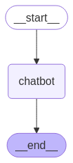

# LangGraph Learning Project

This project follows along with the [LangGraph tutorials](https://langchain-ai.github.io/langgraph/tutorials/introduction/) to learn and implement different aspects of LangGraph, a framework for building stateful, multi-actor applications with LLMs.

## Project Structure

The project is organized into several Python files, each implementing a different aspect of LangGraph:

### 0_basic_langgraph.py
A basic implementation of a simple chatbot using LangGraph. This file demonstrates:
- Basic state management using `StateGraph`
- Simple message passing between nodes
- Graph visualization
- Basic LLM integration with OpenAI

The graph structure is visualized below:



### 1_websearch.py
An enhanced version of the chatbot that incorporates web search capabilities using the Tavily search API. This file demonstrates:
- Tool integration with LLMs
- Conditional routing between nodes
- Tool execution and response handling
- More complex graph structure with tool nodes

The graph structure is visualized below:


## Setup

1. Create a virtual environment:
```bash
python -m venv .venv
source .venv/bin/activate  # On Windows: .venv\Scripts\activate
```

2. Install dependencies:
```bash
pip install -r requirements.txt
```

3. Set up environment variables in `.env`:
```
OPENAI_API_KEY=your_openai_api_key
TAVILY_API_KEY=your_tavily_api_key
```

## Usage

Each Python file can be run independently to demonstrate different aspects of LangGraph:

```bash
python 0_basic_langgraph.py
python 1_websearch.py
```

## Dependencies

- langgraph
- langchain
- langchain-openai
- python-dotenv
- graphviz (for visualization)

## Learning Resources

- [Official LangGraph Documentation](https://langchain-ai.github.io/langgraph/tutorials/introduction/)
- [LangGraph GitHub Repository](https://github.com/langchain-ai/langgraph)

## Project Status

This is a work in progress, following along with the LangGraph tutorials. More examples and implementations will be added as the tutorials progress. 